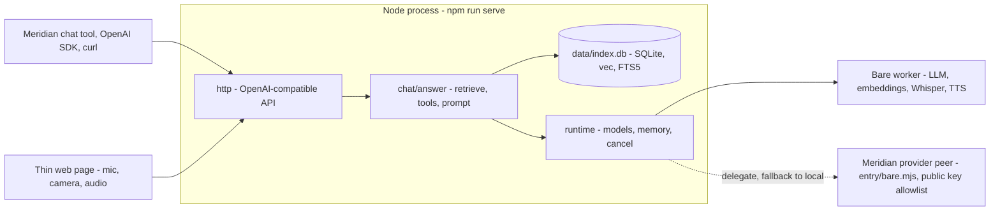
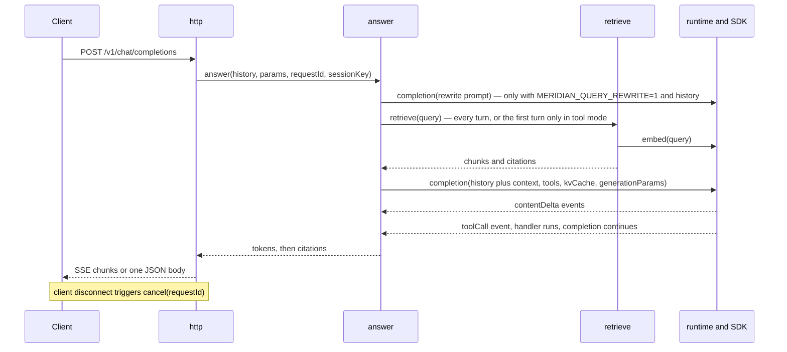
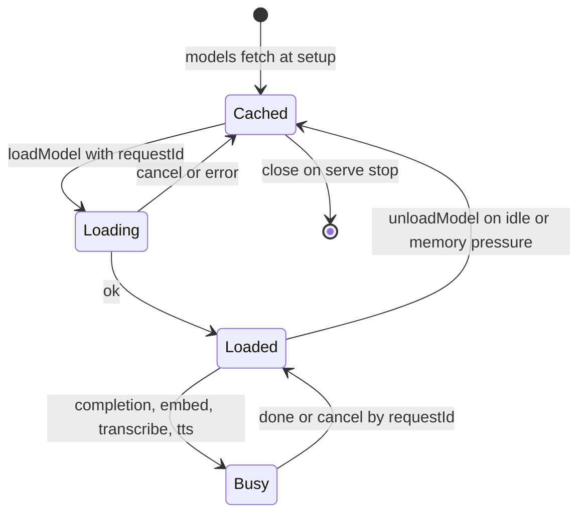

# Architecture — Meridian on-device assistant

Draft for approval, 2026-09-15. SDK facts verified against `@qvac/sdk` 0.19.1 / 0.18.2 tarballs and the SDK docs.

## 1. Shape of the product

- A **local HTTP service** per machine, OpenAI-compatible at `http://127.0.0.1:11434/v1`.
- **Primary UI = Meridian's existing chat tool.** A thin `/ui` page served by the same process covers only mic, camera and audio. No Electron, no second app.
- Installer = code only. Weights are fetched at `setup` into a local cache; `serve` never touches the network.
- Everything the model sees stays on the device, or goes to a Meridian-owned peer over an encrypted P2P stream.

## 2. SDK reality check

| Fact (verified) | Impact |
|---|---|
| P2P delegation (`startQVACProvider`, `loadModel({ delegate })`) was **removed in 0.19.0**; last version with it is **0.18.2**. | Req 5.1 as written needs 0.18.x → decision D1. |
| Built-in RAG workspace is documented as prototype-only. | Own SQLite store fed by `ragChunk()` + `embed()`. |
| `qvac serve --openai` is a pure model pass-through. | Own OpenAI layer that always runs retrieval + tools (6.1.1). |
| `completion({ generationParams: { temp, seed, top_p, predict }, kvCache: "<key>", tools: [zod] })`. | Direct mapping for 6.1.3, 6.3, 3.1. |
| Every long call returns `requestId`; `cancel({ requestId })` covers loads, downloads, inference. | One cancel registry (1.4). |
| Images = message `attachments: [{ path }]` + `modelConfig.projectionModelSrc`. | One multimodal LLM can do chat, tools and vision. |
| Node ≥ 22.17. Windows needs Vulkan ≥ 1.4 even for CPU. `assessModelFit` exists only in 0.19. | README + Raj answers; tiering uses `getSystemResources()`. |

## 3. Decisions

| # | Decision | Why |
|---|---|---|
| D1 | **Pin `@qvac/sdk@0.18.2` + `@qvac/cli@0.12.0`.** Ask the SDK vendor at kickoff. Contingency: 0.19 + own Hyperswarm delegation in `src/p2p/`. | Only released version with the delegation API the brief names. SDK is isolated in one folder, so switching is contained. |
| D2 | Node hosts HTTP + SQLite; inference runs in the SDK's Bare worker; a second entry `entry/bare.mjs` runs the same runtime in-process on Bare for the provider box. | Covers "Node.js and Bare" honestly; core never imports `node:*`. |
| D3 | `src/runtime/` is the only module that sees the SDK (`createRuntime({ sdk })`). `http/` imports only `chat/answer.mjs`. | Makes a "temporary pass-through" impossible to ship. |
| D4 | Fastify, ESM, plain JS + JSDoc (`tsc --checkJs`). | Already in repo, same as `@qvac/cli`; no build step for Bare. |
| D5 | SQLite file `data/index.db`: `node:sqlite` + `sqlite-vec` + FTS5. Dimension read from the embedding model, asserted on open. `VectorStore` interface; LanceDB fallback. | Hybrid search catches part numbers and dates; one file, zero services. |
| D6 | Retrieval is **unconditional** before the first model call. Tools `list_documents`, `stock`, `search_corpus` are additive. | `citations[]` never depends on a 2B model choosing a tool; `seed` stays meaningful. |
| D7 | Runtime tiers by total RAM minus a 3.5 GiB reserve. **M (default, the 2019 laptop, ctx 16k):** `QWEN3_5_2B_MULTIMODAL_Q4_K_M` + mmproj, `EMBEDDINGGEMMA_300M_Q8_0`, `WHISPER_BASE_Q8_0`, `TTS_MULTILINGUAL_SUPERTONIC3_Q4_0`. **S (6 GB, ctx 8k):** `QWEN3_5_0_8B_MULTIMODAL_Q8_0` + its mmproj for vision, `WHISPER_TINY`. **L / provider (12 GB, ctx 32k):** `QWEN3_5_4B_MULTIMODAL_Q4_K_M` shared by chat and vision, `WHISPER_SMALL_Q8_0`. Below 5 GB `serve` refuses to start. | Fits ~4.5 GB budget on M. All three chat models are Qwen3.5 (hybrid attention, 12–32 KB of KV per token), so one session's conversation fits the context; `evals/` measures tool-call quality per tier. |
| D8 | Memory manager: embeddings + one LLM resident; ASR/TTS/VLM load on demand, unload after 5 min idle or on pressure; loads serialized. Budget = `min(free × 0.6, 5 GB)`. | Only way to fit five capabilities in 8 GB. |
| D9 | Delegation sends only the grounded prompt to a provider chosen by public key with `fallbackToLocal: true`; provider firewall = consumer allowlist; stable key via `QVAC_HYPERSWARM_SEED`. Corpus, index, audio, images never leave. | Meets C1 in the P2P path; I.1 becomes config, not architecture. |
| D10 | `citations[]` = retrieved chunks above a threshold, deduped by file, max 5, `file` relative to the corpus root. Non-stream on `message`, stream on the final delta. | Never parsed from model text (C2, 6.1.2). |
| D11 | `models:fetch` downloads via `downloadAsset()` from the registry constant with `fallbackSrc` HTTPS, or from `MERIDIAN_MODELS_DIR`; writes `data/models/manifest.json`. `serve` loads **only manifest paths**. | Two+ sources (1.2) and a hard offline guarantee. |
| D12 | `qvac.config.json` lists 4 plugins: `llamacpp-completion`, `llamacpp-embedding`, `whispercpp-transcription`, `onnx-tts`. `qvac bundle sdk` + esbuild; `bench/bundle-size.mjs` for the report. | 6.2 from the first commit. |
| D13 | Logs in `data/logs/`, never prompts or corpus text. On disk: weights, `index.db`, KV-cache files, logs. Nothing else. | Raj's first question. |

## 4. System



```
qvac-eval.json  qvac.config.json  package.json
scripts/   models-fetch.mjs, corpus-ingest.mjs
src/
  entry/     node.mjs (Fastify, PID file), bare.mjs (provider, no HTTP)
  runtime/   index (lifecycle), models (alias→tier→src), capability (tiers),
             memory (resident set, LRU), cancel (requestId registry), session (kvCache keys)
  rag/       parse, ingest, store (VectorStore), retrieve (hybrid → citations)
  chat/      answer.mjs (async generator), prompt.mjs, openai-map.mjs
  tools/     list-documents, stock (from stock-tool.zip), search-corpus
  http/      server, openai (/v1/models, /v1/chat/completions, /v1/embeddings),
             audio (/v1/audio/transcriptions, /v1/audio/speech), meridian (cancel, health)
  ui/        static voice + camera loop against our own /v1 API
  adapters/  node-fs, node-sqlite, bare-fs
test/      offline-e2e.mjs, unit/
bench/     bundle-size.mjs
data/      git-ignored: models/, corpus/, index.db, kv-cache/, logs/
```

## 5. Request flow



Rules: retrieval first (before every turn in `MERIDIAN_RETRIEVAL_MODE=auto`; before the first turn of a session in `tool` mode, where later turns retrieve through the `search_documents` tool); with `MERIDIAN_QUERY_REWRITE=1` a turn with history first asks the chat model for a standalone search query; `MERIDIAN_FUSION` picks RRF, cosine or BM25 (ADR-012); empty retrieval → the model is told the corpus has no answer and `citations` is `[]`; max 3 tool rounds; the same generator feeds SSE, JSON, the voice loop and tests.

## 6. Model lifecycle



Readiness (`GET /v1/models` → 200) only after embeddings + LLM are loaded and `index.db` opens with a matching dimension.

## 7. Data flow

`corpus.zip` → `data/corpus/` (byte-identical; relative path = citation `file`) → per-type parse (md/txt/csv/eml; audio via `transcribe()`; images inventoried for the VLM; unknown types listed in the ingest report) → `ragChunk({ chunkStrategy: "paragraph", splitStrategy: "token", chunkSize: 512, chunkOverlap: 64 })` → `embed()` in batches → one LanceDB table `meridian_corpus` (`id`, `vector`, `text`, `file`, `chunk_index`, `content_hash`, …) with a full-text index on `text`. Idempotent by `sha256`, resumable per document.

Retrieval (as shipped): vector top-5 ∪ BM25 top-5 → reciprocal-rank fusion (k = 60) → top-5 chunks into the user turn. Only the last user turn carries excerpts: earlier ones are replayed as the bare question, so the context does not grow with retrieval (ADR-014; `MERIDIAN_CONTEXT_LAYOUT=all` keeps them and the KV cache, `MERIDIAN_CONTEXT_BUDGET` keeps both until a budget is crossed). A follow-up that cannot be searched on its own is searched for together with the last three questions (`QUERY_HISTORY_*`). `MERIDIAN_FUSION=cosine|bm25` keeps one leg, `MERIDIAN_RETRIEVAL_MODE=tool` moves retrieval after the first turn into the `search_documents` tool, `MERIDIAN_QUERY_REWRITE=1` searches for a rewritten query (ADR-012; the eval compares them).

## 8. Eval contract

| Script | Network | Does |
|---|---|---|
| `npm ci` | yes | deps; `postinstall` runs `qvac bundle sdk` |
| `npm run models:fetch` | yes | tier → downloads → `manifest.json` (cancellable, resumable) |
| `npm run corpus:ingest` | no | §7 |
| `npm run serve` | **no** | manifest paths only → readiness gate |
| `npm run serve:stop` | no | PID → SIGTERM → unload all → `close()` |

`test/offline-e2e.mjs` repeats this with outbound traffic blocked and checks values + `citations[].file`.

## 9. Traceability

| Req | Module | Req | Module |
|---|---|---|---|
| 1.1 | `runtime/`, offline e2e | 4.1 | `http/audio.mjs`, Whisper tiers |
| 1.2 | `runtime/models.mjs` (registry + HTTPS + fs) | 4.2 | `ui/` loop over our own API |
| 1.3 | `runtime/index.mjs`, `entry/node.mjs` | 4.3 | mmproj on tier LLM, `attachments` |
| 1.4 | `runtime/cancel.mjs`, `http/meridian.mjs` | 5.1, 5.1.1 | `entry/bare.mjs`, delegate option |
| 2.1–2.3 | `scripts/corpus-ingest.mjs`, `rag/` | 5.2 | `runtime/capability.mjs` |
| 2.4 | `chat/answer.mjs` → SSE | 6.1.x | `http/openai.mjs`, `chat/openai-map.mjs` |
| 3.1.x | `tools/`, tool loop in `answer.mjs` | 6.2.x | `qvac.config.json`, `bench/` |
| 6.1.4 | `qvac-eval.json` | 6.3 | `runtime/session.mjs` |

## 10. Risks and questions

- **R1** Delegation only in 0.18.x → D1, ask the SDK vendor, contingency ready.
- **R2** Tool-calling of a 2B model → unconditional retrieval, strict Zod, measured in Stage 1, fallback model.
- **R3** Intel iGPU without usable Vulkan → CPU inference; tier S/M sizes, small `ctx_size`, streaming.
- **R4** `sqlite-vec` binary per OS/arch → `VectorStore` interface, LanceDB fallback.
- **Assumptions:** corpus is tens of MB; one user per machine; Windows/macOS laptops, Linux provider.
- **Ask the SDK vendor:** is 0.18.x delegation expected, or is there a 0.19+ replacement? **Ask Raj:** log retention, `data/` location, MDM package format; whether the eval harness may grade answers with a hosted model (`evals/` has an opt-in `--judge-backend claude-cli` that sends the fictional eval corpus excerpts to Anthropic; the product never does). **Ask Dana:** corpus update cadence, field languages; whether a first answer that takes about 5 s extra after an hour of no use is acceptable (the chat model unloads after that hour to free 1.5 GB on the fleet laptop; `MERIDIAN_RESIDENT_IDLE_MS`).

## 11. Stages

0. Skeleton: ESM, 4-plugin `qvac.config.json`, lifecycle on one small model, `qvac-eval.json`, `/v1/models` 200, `serve:stop`.
1. **Req 1**: two sources + manifest, tiers, load → infer → unload → close, cancel by `requestId`, offline e2e scaffold.
2. Req 2 + 6.1: ingest, store, hybrid retrieval, streaming answers with `citations[]`, `temperature`/`seed`.
3. Req 3, 6.2, 6.3: tools, bundle + size report, KV-cache sessions.
4. Req 4, 5: audio endpoints + UI loop, vision, provider entry + delegation + fallback.
5. Docs, README, diagrams, reports; client-facing package in parallel.
